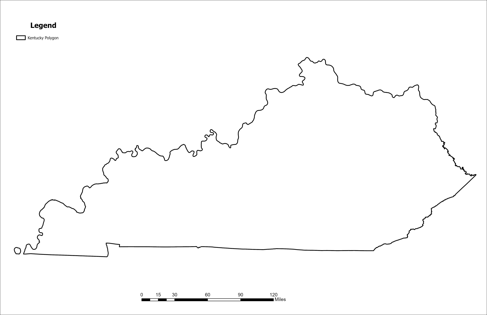

# hello-world

A map made from lidar derived surface elevations and made in ArcGIS Pro Spring 2025

* Data from kyraster.ky.gov
* NDVI greater 0.1 values used to find vegetated areas 
* Heights greater 5 feet

[Visit my webpage](#)

## Kentucky Outline

*Download [GeoPDF](Layout-Ky-Land-Cover.PDF)*

